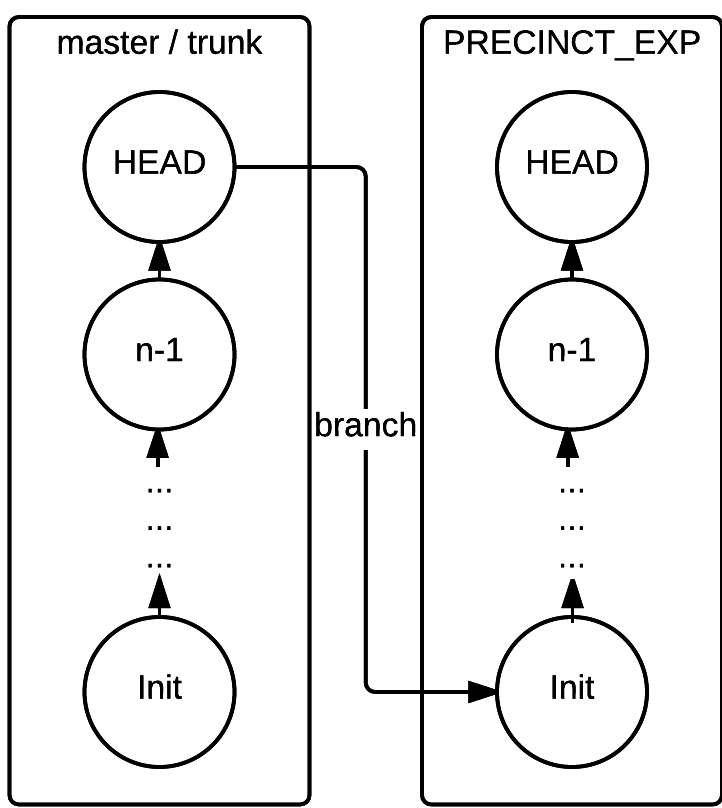

Introduction {#sec:Introduction}
============

Code clones appear when developers reuse code with little to no modification to the original code.
Studies have shown that clones can account for up to 50% of code in a given software system [@Baker; @StephaneDucasse].
Developers often reuse code (and create clones) in their software on purpose [@Kim2005].
Nevertheless, clones are generally considered a bad practice in software development since they may introduce bugs [@Kapser2006; @Juergens2009; @Li2006].
If a bug is discovered in one segment of the code that has been copied and pasted several times, then the developers will have to remember the places where this segment has been reused to fix the bug in each place.

[WAHAB: YOU NEED TO REWRITE THIS PART BY FOCUSING ON TWO CATEGORIES: SEE MY EMAIL] -----------------------------]
In the last two decades, there have been many studies and tools that aim at detecting clones. They can be grouped into two caterogories:three categories.
The first category includes techniques that treat the source code as text and use transformation and normalization methods to compare various code fragments [@Johnson1994; @Johnson1993; @Cordy2011; @Roy2008].
The second category includes methods that
use lexical analysis, where the source code is sliced into sequences of tokens, similar to the way a compiler operates [@Baker; @Bakera; @Baker2002; @Kamiya2002; @Li2006].
The tokens are used to compare code fragments.
Finally, syntactic analysis has also been performed where the source code is converted into trees, more particularly abstract syntax tree (AST), and then the clone detection is performed using tree matching algorithms [@Baxter1998; @Komondoor2000; @Tairas2006; @Falke2008].
Although these techniques and tools have been shown to be useful in detecting clones, they operate in an offline fashion (i.e., after the clones have been inserted). Software developers might be reluctant to use these tools on a day-to-day basis (i.e., as part of the continuous development process) unless they are involved in a major refactoring effort. This problem is somehow similar to the problem of adopting bug identification tools. Johnson et al. [@Johnson2013] showed that these tools are challenging to use because they do not integrate well with the day-to-day workflow of a developer. Also, they output a large amount of data when applied to the entire system, making it hard to understand and analyze their results.
[WAHAB: END OF COMMENT ---------------------------------------------------------------------------------------------]

In this paper, we present PRECINCT (PREventing Clones INsertion at Commit Time) that focuses on preventing the insertion of clones at commit time, i.e., before they reach the central code repository. PRECINCT is clone detection technique that relies on the use of pre-commit hooks capabilities of modern source code version control systems. A pre-commit hook is a process that one can implement to receive the latest modification to the source code done by a given developer just before the code reaches the central repository.
PRECINCT intercepts this modification and analyses its content to see whether a suspicious clone has been introduced or not.
A flag is raised if a code fragment is suspected to be a clone of an existing code segment.
In fact, PRECINCT, itself, can be seen as a pre-commit hook that detects clones that might have been inserted in the latest changes with regard to the rest of the source code.
This said, only a fraction of the code is analysed, making PRECINCT efficient compared to leading clone detection techniques such as NICAD (Accurate Detection of Near-miss Intentional Clones) [@Cordy2011].
Moreover, the detected clones are presented using a classical ‘diff’ output that developers are familiar with.
PRECINCT is also well integrated with developers' workflow since it is used in conjunction with a source code version control systems such as Git [^1].

Many taxonomies have been published in an attempt to classify clones into types [@Mayrand1996; @Balazinska1999; @Koschke2006; @Bellon2007; @Kontogiannis; @Kapser].
Despite the particularities of each proposed taxonomy, researchers agree on the following classification.
Type 1 clones are copy-pasted blocks of code that only differ from each other regarding non-code artifacts such as indentation, whitespaces, comments and so on.
Type 2 clones are blocks of code that are syntactically identical except literals, identifiers, and types that can be modified.
Also, Type 2 clones share the particularities of Type 1 about indentation, whitespaces, and comments.
Type 3 clones are similar to Type 2 clones regarding modification of literals, identifiers, types, indentation, whitespaces, and comments but also contain added or deleted code statements.
Finally, Type 4 are code blocks that perform the same tasks but using a completely different implementation.

In this study, we focus on Type 3 clones as they are more challenging to detect. Since Type 3 clones include Type 1 and 2 clones, then these types could be detected separately by PRECINCT as well.

We evaluated the effectiveness of PRECINCT using precision and recall on three systems, developed independently and written in both C and Java. The results show that PRECINCT prevents Type 3 clones to reach the final source code repository with an average accuracy of 97.7%.

The rest of this paper is organized as follows: In Section \ref{sec:Related-Work}, we present the studies related to PRECINCT. Then, in Section \ref{sec:The-PRECINCT-Approach}, we present the PRECINCT approach. The evaluation of PRECINCT is the subject of Section \ref{sec:Experimentations}, followed by threats to validity.
Finally, we conclude the paper in Section \ref{sec:Conclusion}.

Related Work {#sec:Related-Work}
============

Clone detection is an important and difficult task. Throughout the years, researchers and practitioners have developed a considerable number of methods and tools to detect efficiently source code clones.

Tung _et al_ proposed an advanced clone-aware source code management system called Clever. Their approach uses abstract syntax trees to detect, update, and manage clones. While efficient, their approach does not prevent the introduction of clones and it is not incremental. Developers have to run a project-wide detection for each commit of a version of the program. The same teams [Hoan Anh Nguyen et al.] conducted  follow-up study by making Clever incremental. Their new tool, JSync, is an incremental clone detector that will only perform the detection of clones on the new changes. While the new version of their work is incremental, it is different from PRECINCT is the sense that their approach relies on developers to run the approach manually on all the changes to automatically prevent the insertion of clones. [WAHAB: YOU NEED TO ARGUE BETTER. IT SEEMS TO ME THAT THEY DID ALREADY WHAT WE ARE PROPOSING]

Yuki _et al_ conducted one of the few studies on the application of clone management to industrial systems.They implemented a tool named Clone Notifier at NEC with the help of experienced practitioners. They specifically focus on clone insertion notification, very much like PRECINCT. Unlike PRECINCT, their approach uses an offline approach in which the changes are commited (i.e, they reach the central repository and anyone can pull them into they machines) and a central server analyses the changes. If the commited changes contain newly inserted clones, then an email notification is sent. We first argue that detecting clones in an offline fashion can be damaging for the project as clone can be synchronized by other team members, which can lead to challenging merges when the clones are removed. Secondly, the authors did not report any performance measurements and the longer it takes for the notification to be sent to the developer, the harder it can be to reconstruct the mind-map required for clone removal. PRECINCT, however, is able to perform an incremental online detection in few seconds. 

Gode and Koschke [REF] proposed an incremental clone detector that relies on the results of analysis from past versions of a system to only analyse the new changes. 
Their clone detector takes the form of an IDE plugin that alerts developers as soon as a clone is inserted in the program. IDE warnings can be quite distracting as shown by XXXX []. PRECINCT operates at commit-time, and hence we believe it fits better within the developer's workflow.

Tree-matching and metric-based  methods are two sub-categories of syntactic analysis for clone detection.
Syntactic analysis consists of building abstract syntax trees (AST) and analyse them with a set of dedicated metrics or searching for identical sub-trees.
Many existing AST-based approaches rely on sub-tree comparison to detect clone, including the work of Baxter et al.[@Baxter1998], Wahleret et al. [@Wahler], and the work of Jian et al. with Deckard [@Jiang2007].
An AST-based approach compares metrics computed on the AST, rather than the code itself, to identify clones [@Patenaude1999; @Balazinska].

Another approach to detecting clones is to use static analysis and to leverage the semantics of a program to improve the detection.
These techniques rely on program dependency graphs, where nodes are statements and edges are dependencies.
Then, the problem of finding clones is reduced to the problem of finding identical sub-groups in the program dependency graph.
Examples of existing techniques that fall into this category are the ones presented by Krinke et al.[@Krinke2001] and Gabel et al. [@Gabel2008].

Many clone detection tools have been created using a lexical approach for clone detection. Here, the code is transformed into a series of tokens. If sub-series repeat themselves, it means that a potential clone is in the code. Some popular tools that use this technique include Dup [@Baker], CCFinder [@Kamiya2002], and CP-Miner [@Li2006].

Niko _el al._ proposed techniques revolving around hashing to obtain a quick answer while detecting type-1, type-2, and type-3 clones in Squeaksource [@Niko2012]. 
While their approach works on a single system (i.e., detecting clones on one version of one system), they found that more than 14% of all clones are copied from project to project, stressing the need for fast and scalable approaches for clone detection to detect clone across a large number of projects. 
On the performance side, Niko _el al._ were able to perform clone detection on 74,026 classes in 14:45 hours (4,747 class per hour) with a 8 core Xeon at 2.3 GHz with 16 GB of RAM.
While these results are promising, especially because the approach detects clones across projects and versions, the computing power required is still considerable. 

Similarly, Saini _et al_ and Sajnani _et al_ proposed an approach, called SourcererCC [@Saini2016; @Sajnani2016].
SourcererCC targets fast clone detection on developers' workstation (12 GB RAM). 
SourcererCC is a token-based clone detector that uses an optimized inverted-index. It was tested on 25K projects cumulating 250 MLOC. The technique achieves a precision of 86% and a recall of 86%-100% for clones of Type 1, 2 and 3.

Toomey _el al._ also proposed an efficient token based approach for detecting clones called ctcompare [@Toomey2012].
Their tokenization is, however, different than most approaches as they used lexical analysis to produce sequences of tokens that can be transformed into token tuples.
ctcompare is accurate, scalable and fast but does  not detect Type 3 clones.

While faster algorithms are proposed, and the workstations of developers get more powerful, the exponential growth of source code base makes the detection of clones a time computing task for developers.
Even with the most modern and fast approaches, the computation time for a large project is measured in hours.
To cope with this problem, incremental clone detection has been introduced.
Incremental clone detection is a technique where only the changes from one version to another are analysed.
Thus, the computational time is greatly reduced.
In 2010, Hummel _et al._ proposed an approach that is both incremental and scalable using index-based clone detection [@Hummel2010].
Using more than 100 machines in a cluster, they managed to drop the computation time of Type 1 and 2 to less than a second while comparing a new version. 
The time required to find all the clones on a 73 MLOC system was 36 minute.
We are able to reach similar performances, for one revision, using a single machine.
While being extremely fast and reliable, Hummel _et al._'s approach required an industrial cluster to achieve such performance.
In our opinion, it is unlikely that standard practitioners have access to such computational power.
Moreover, the authors' approach only targets Type 1 and 2 clones.
Higo _et al._ proposed an incremental clone detection approach based on program dependency graphs (PDG) [@Higo2011]. 
Using PDG is arguably more complex than text comparison and allows the detection of clone structures that are scattered in the program.
They were able to analyse 5,903 revisions in 15 hours in Apache Ant.  

The aforementioned techniques focus on detecting clones after they are inserted in code. 
Very few studies focus on preventing the insertion of clones. Tung _et al_ proposed an advanced clone-aware source code management system called Clever. Their approach uses abstract syntax trees to detect, update, and manage clones. While efficient, their approach does not prevent the introduction of clones and it is not incremental. Developers have to run a project-wide detection for each commit of a version of the program. The same teams [Hoan Anh Nguyen et al.] conducted  follow-up study by making Clever incremental. Their new tool, JSync, is an incremental clone detector that will only perform the detection of clones on the new changes. While the new version of their work is incremental, it is different from PRECINCT is the sense that their approach relies on developers to run the approach manually on all the changes to automatically prevent the insertion of clones.

Yuki _et al_ conducted one of the few studies on the application of clone management to industrial systems.They implemented a tool named Clone Notifier at NEC with the help of experienced practitioners. They specifically focus on clone insertion notification, very much like PRECINCT. Differently to PRECINCT, however, they use an offline approach in which the changes are commited (i.e, they reach the central repository and anyone can pull them into they machines) and a central server analyzes the changes. If the commited changes contain newly inserted clone, then, an email notification is sent.We first argue that detecting clones in an offline fashion can be damaging for the project as clone can be syncronized by other team members which can lead to challenging merges when the clones will be removed. Secondly, they did not report any performances measurements and the longer it takes for the notification to be sent to the developer, the harder it can be for him to reconstruct the mind-map required for clone removal. Unfortunately, we cannot assess this point for Clone Notifier. PRECINCT, however, is able to perform an incremental online detection in few seconds. 

Gode and Koschke [REF] proposed an incremental clone detector that relies on the results of analysis from past versions of a system to only analyse the new changes. 
Their clone detector takes the form of an IDE plugin that alerts developers as soon as a clone is inserted in the program. IDE warnings can be quite distracting as shown by XXXX []. PRECINCT operates at commit-time, and hence we believe it fits better within the developer's workflow.
Text-based techniques use the code and compare sequences of code blocks to each other to identify potential clones. Johnson was perhaps the first one to use fingerprints to detect clones [@Johnson1993; @Johnson1994]. Blocks of code are hashed, producing fingerprints that can be compared.
If two blocks share the same fingerprint, they are considered as clones.
Manber et al. [@Manber1994] and Ducasse et al. [@Ducasse1999] refined the fingerprint technique by using leading keywords and dot-plots.

PRECINCT aims to prevent clone insertion at commit-time. This way, software developers do not have to resort to external tools  or IDE plugins to remove clones after they are inserted. Our approach notifies software developers of possible clones as they commit their code.
It is our opinion that clone detection should be part of the "Just-In-Time Quality Assurance" [@Kamei2013b] movement where defect prediction models identify risky changes as soon as they are committed. 
This allows for less time-consuming approaches where developers can analyse risky changes while they are still fresh in their minds rather than being assigned a list of risky packages/class to review by the quality insurance team.
Zibran recently proposed an infrastructure for integrating clone management that covers clone detection and refactoring on developers' workstations supported by a remote server infrastructure [@Zibran2016].
It could, if implemented, fit in the category of "Just-In-Time Clone Detection."
This work is close to ours in the sense that the authors propose an incremental clone detection that integrates well with the workflow of developers.
We argue, however, that our approach is simpler to implement and uses directly the code versioning tool rather than yet another plugin in the developer's IDE. 
Finally, our approach has been implemented and tested, while the approach presented by Zibran _et al._ is only conceptual.

[YOU CAN REMOVE THIS PART]
Other active research activities in clone detection focus on clone removal and management. Once detected, an obvious step is to provide approaches to remove clones in an automatic way or (at least) keep track of them if removing them is not an option.
Most modern IDEs provide the *extract method* feature that transforms a potentially copy-pasted block of code into a method and a call to the newly generated method [@Komondoor; @higo2004refactoring].
More advanced techniques (see Codelink [@Toomim] and [@Duala-Ekoko2007]) involve analyzing the output of CCFinder [@Kamiya2002a; @Livieri2007] or program dependencies graphs [@higo2004refactoring] to automatically suggest a method that would go through the *extract method* process.

The PRECINCT Approach {#sec:The-PRECINCT-Approach}
=====================

\begin{figure*}
  \centering
  \includegraphics[width=0.85\textwidth]{media/approach.png}
  \caption{Overview of the PRECINCT approach.}
\end{figure*}

The PRECINCT approach is composed of six steps.
The first and last steps are typical steps that a developer would do when committing code.
The first step is the commit step where developers send their latest changes to the central repository, and the last step is the reception of the commit by the central repository.
The second step is the pre-commit hook, which kicks in as the first operation when one wants to commit.
The pre-commit hook has access to the changes regarding the files that have been modified, more specifically, the lines that have been modified. The modified lines of the files are sent to TXL [@Cordy2006a] for block extraction. Then, the blocks are compared to previously extracted blocks to identify candidate clones using the comparison engine of NICAD [@Cordy2011]. We chose NICAD engine because it has been shown to provide high accuracy [@Cordy2011]. The tool is also readily available, easy to use, customizable, and works with TXL. Note, however, that PRECINCT can also work with other engines for comparing code fragments.
Finally, the output of NICAD is further refined and presented to the user for decision.
These steps are discussed in more detail in the following subsections.

Commit {#sub:Commit}
------

In version control systems, a commit adds the latest changes made to the source code to the repository, making these changes part of the head revision of the repository.
Commits in version control systems are kept in the repository indefinitely. Thus, when other users do an update or a checkout from the repository, they will receive the latest committed version, unless they wish to retrieve a previous version of the source code in the repository.
Version control systems allow rolling back to previous versions easily.
In this context, a commit within a version control system is protected as it is easily rolled back, even after the commit has been done.

Pre-Commit Hook {#sub:Pre-Commit-Hook}
---------------

Hooks are custom scripts set to fire off when certain important actions occur.
There are two groups of hooks: client-side and server-side.
Client-side hooks are triggered by operations such as committing and merging, whereas server-side hooks run on network operations such as receiving pushed commits.
These hooks can be used for all sorts of reasons such as compliance to coding rules or automatic run of unit test suites.

The pre-commit hook is run first, before one even types in a commit message. It is used to inspect the snapshot that is about to be committed.
Depending on the exit status of the hook, the commit will be aborted and not pushed to the central repository.
Also, developers can choose to ignore the pre-hook. In Git, for example, they will need to use the command `git commit –no-verify` instead of `git commit`.
This can be useful in case of an urgent need for fixing a bug where the code has to reach the central repository as quickly as possible.
Developers can do things like check for code style, check for trailing white spaces (the default hook does exactly this), or check for appropriate documentation on new methods.

PRECINCT is a set of bash scripts where the entry point of these scripts lies in the pre-commit hooks. Pre-commit hooks are easy to create and implement.
Note that even though we use Git as the main version control to present PRECINCT, we believe that the techniques presented in this paper are readily applicable to other version control systems.

Extract and Save Blocks {#sub:Extract-and-Save-Blocks}
-----------------------

A block is a set of consecutive lines of code that will be compared to all other blocks to identify clones.
To achieve this critical part of PRECINCT, we rely on TXL [@Cordy2006a], which is a first-order functional programming over linear term rewriting, developed by Cordy et al.[@Cordy2006a].
For TXL to work, one has to write a grammar describing the syntax of the source language and the transformations needed. TXL has three main phases: *parse, transform*, *unparse*.
In the parse phase, the grammar controls not only the input but also the output form.
Listing \ref{txlsample} — extracted from the official documentation [^2] — shows a grammar matching an *if-then-else* statement in C with some special keywords: [IN] (indent), [EX] (exdent) and [NL] (newline) that will be used for the output form.

~~~~{language=Bash firstnumber=1 numbers=left stepnumber=1 label=txlsample caption="Txl Sample" xleftmargin=10mm framexleftmargin=10mm frame=single}
define if_statement
  if ( [expr] ) [IN][NL]
    [statement] [EX]
    [opt else_statement]
end define

define else_statement
  else [IN][NL]
    [statement] [EX]
end define
~~~~

Then, the *transform* phase will, as the name suggests, apply transformation rules that can, for example, normalize or abstract the source code. Finally, the third phase of TXL called *unparse*, unparses the transformed parsed input to output it.
Also, TXL supports what the creators call Agile Parsing [@Dean], which allows developers to redefine the rules of the grammar and, therefore, apply different rules than the original ones.

PRECINCT takes advantage of that by redefining the blocks that should be extracted for the purpose of clone comparison, leaving out the blocks that are out of scope.
More precisely, before each commit, we only extract the blocks belonging to the modified parts of the source code.
Hence, we only process, in an incremental manner, the latest modification of the source code instead of the source code as a whole.

We have selected TXL for several reasons. First, TXL is easy to install and to integrate with the normal workflow of a developer.
Second, it was relatively easy to create a grammar that accepts commits as input.
This is because TXL is shipped with C, Java, C-sharp, Python and WSDL grammars that define all the particularities of these languages, with the ability to customize these grammars to accept changesets (chunks of the modified source code that include the added, modified, and deleted lines) instead of the whole code.

Algorithm \ref{alg:extract} presents an overview of the “extract" and “save" blocks operations of PRECINCT. This algorithm receives as arguments, the changesets, the blocks that have been previously extracted and a boolean named compare\_history.
Then, from Lines 1 to 9 lie the $for$ loop that iterates over the changesets. For each changeset (Line 2), we extract the blocks by calling the $~extract\_blocks(Changeset~cs)$ function.
In this function, we expand our changeset to the left and the right to have a complete block.

\input{tex/algorithm}

~~~~{language=Bash firstnumber=1 numbers=left stepnumber=1 label=commitsample caption="Changeset c4016c of monit"  xleftmargin=10mm framexleftmargin=10mm frame=single}
@@ -315,36 +315,6 @@
int initprocesstree_sysdep
    (ProcessTree_T **reference) {
        mach_port_deallocate(mytask,
          task);
    }
}
- if (task_for_pid(mytask, pt[i].pid,
-      &task) == KERN_SUCCESS) {
-   mach_msg_type_number_t   count;
-   task_basic_info_data_t   taskinfo;
-   thread_array_t           threadtable;
-   unsigned int             threadtable_size;
-   thread_basic_info_t      threadinfo;
~~~~

As depicted by Listing \ref{commitsample}, changesets contain only the modified chunk of code and not necessarily complete blocks. Indeed, we have a block from Line 3 to Line 6 and deleted lines from Line 8 to 14.
However, in Line 7 we can see the end of a block, but we do not have its beginning. Therefore, we need to expand the changeset to the left to have syntactically correct blocks.
We do so by checking the block’s beginning and ending (using { and }) in C for example.
Then, we send these expanded changesets to TXL for block extraction and formalization.

For each extracted block, we check if the current block overrides (replaces) a previous block (Line 4).
In such a case, we delete the previous block as it does not represent the current version of the program anymore (Line 5).
Also, we have an optional step in PRECINCT defined in Line 4. The compare\_history is a condition to delete overridden blocks.

We believe that deleted blocks have been deleted for a good reason (bug, default, removed features, …) and if a newly inserted block matches an old one, it could be worth knowing to improve the quality of the system at hand.
This feature is deactivated by default.

In summary, this step receives the files and lines, modified by the latest changes made by the developer and produces an up to date block representation of the system at hand in an incremental way.
The blocks are analyzed in the next step to discover potential clones.

Compare Extracted Blocks {#sub:Compare-Extracted-Blocks}
------------------------

To compare the extracted blocks and detect potential clones, we can only resort to text-based techniques.
This is because lexical and syntactic analysis approaches (alternatives to text-based comparisons) would require a complete program to work, a program that compiles.
In the relatively wide-range of tools and techniques that exist to detect clones by considering code as text [@Johnson1993; @Johnson1994; @Marcus; @Manber1994; @StephaneDucasse; @Wettel2005], we selected NICAD as the main text-based method for comparing clones [@Cordy2011] for several reasons.
First, NICAD is built on top of TXL, which we also used in the previous step.
Second, NICAD can detect Type 1, 2 and 3 clones.

NICAD works in three phases: *Extraction*, *Comparison* and *Reporting*. During the *Extraction* phase all potential clones are identified, pretty-printed, and extracted.
We do not use the *Extraction* phase of NICAD as it has been built to work on programs that are syntactically correct, which is not the case for changesets.
We replaced NICAD’s *Extraction* phase with our scripts, described in the previous section.

In the *Comparison* phase, extracted blocks are transformed, clustered and compared to find potential clones.
Using TXL sub-programs, blocks go through a process called pretty-printing where they are stripped of formatting and comments.
When code fragments are cloned, some comments, indentation or spacing are changed according to the new context where the new code is used. This pretty-printing process ensures that all code will have the same spacing and formatting, which renders the comparison of code fragments easier.
Furthermore, in the pretty-printing process, statements can be broken down into several lines.
Table \ref{tab:pretty-printing} [@Iss2009] shows how this can improve the accuracy of clone detection with three `for` statements, ` for (i=0; i<10; i++)`, `for (i=1; i<10; i++)` and ` for (j=2; j<100; j++)`.
The pretty-printing allows NICAD to detect Segments 1 and two as a clone pair because only the initialization of $i$ is changed.
This specific example would not have been marked as a clone by other tools we tested such as Duploc [@Ducasse1999].
In addition to the pretty-printing, code can be normalized and filtered to detect different classes of clones and match user preferences.

\input{tex/pretty-printing-table}

Finally, the extracted, pretty-printed, normalized and filtered blocks are marked as potential clones using a Longest Common Subsequence (LCS) algorithm [@Hunt1977]. Then, a percentage of unique statements can be computed and, depend on a given threshold (see Section \ref{sec:Experimentations}), the blocks are marked as clones.

The last step of NICAD, which acts as our clone comparison engine, is the *reporting*. However, to prevent PRECINCT from outputting a large amount of data (an issue that many clone detection techniques face), we implemented our reporting system, which is also well embedded with the workflow of developers. This reporting system is the subject of the next section.

As a summary, this step receives potentially expanded and balanced blocks from the extraction step.
Then, the blocks are pretty-printed, normalized, filtered and fed to an LCS algorithm to detect potential clones.
Moreover, the clone detection in PRECINCT is less intensive than NICAD because we only compare the latest changes with the rest of the program instead of comparing all the blocks with each other.

Output and Decision {#sub:Output-and-Decision}
-------------------

In this final step, we report the result of the clone detection at commit time on the latest changes made by the developer. The process is straightforward. Every change made by the developer goes through the previous steps and is checked for the introduction of potential clones. For each file that is suspected to contain a clone, one line is printed to the command line with the following options: (I) Inspect, (D) Disregard, (R) Remove from the commit. In comparison to this simple and interactive output, NICAD outputs each and every detail of the detection result such as the total number of potential clones, the total number of lines, the total number of unique line text chars, the total number of unique lines, and so on. We think that so many details might make it hard for developers to react to these results. A problem that was also raised by Johnson et al. [@Johnson2013] when examining bug detection tools.
Then the potential clones are stored in XML files that can be viewed using an Internet browser or a text editor.

\(I) Inspect will cause a diff-like visualization of the suspected clones while (D) disregard will simply ignore the finding.
To integrate PRECINCT in the workflow of the developer, we also propose the remove option (R). This option will simply remove the suspected file from the commit that is about to be sent to the central repository.

Case Study {#sec:Experimentations}
==========

In this section, we show the effectiveness of PRECINCT for
detecting clones at commit time in three open source systems.

The aim of the case study is to answer the following question: *Can we detect clones at commit time, i.e., before they are inserted into the final code, and if so, what would be the accuracy?*

Target Systems {#sub:Target-Systems}
--------------

\begin{table}[]
\centering
\caption{List of Target Systems in Terms of Files and Kilo Line of Code (KLOC) at current version and Language}
\label{tab:sut}
\begin{tabular}{c|c|c|c|c}
SUT        & Revisions & Files & KLoC & Language \\ \hline\hline
Monit      & 826       & 264   & 107  & C        \\ \hline
Jhotdraw   & 735       & 1984  & 44   & Java     \\ \hline
dnsjava    & 1637      & 233   & 47   & Java     \\ \hline
\end{tabular}
\end{table}

Table \ref{tab:sut} shows the systems used in this study and their characteristics in terms of the number files they contain and the size in KLoC (Kilo Lines of Code). We also include the number of revisions used for each system and the programming language in which the system is written.

Monit [^4] is a small open source utility for managing and monitoring Unix systems.
Monit is used to conduct automatic maintenance and repair and supports the ability to identify causal actions to detect errors.
This system is written in C and composed of 826 revisions, 264 files, and the latest version has 107 KLoC.
We have chosen Monit as a target system because it was one of the systems NICAD was tested on.

JHotDraw [^5] is a Java GUI framework for technical and structured graphics.
It has been developed as a “design exercise”. Its design relies heavily on the use of design patterns. JHotDraw is composed of 735 revisions, 1984 files, and the latest revision has 44 KLoC. It is written in Java, and it is often used by researchers as a test bench. JHotDraw was also used by NICAD’s developers to evaluate their approach.

Dnsjava [^6] is a tool for implementing the DNS (Domain Name Service) mechanisms in Java.
This tool can be used for queries, zone transfers, and dynamic updates.
It is not as large as the other two, but it still makes an interesting case subject because it has been well maintained for the past decade. Also, this tool is used in many other popular tools such as Aspirin, Muffin and
Scarab. Dnsjava is composed of 1637 revisions, 233 files; the latest revision contains 47 Kloc.
We have chosen this system because we are familiar with it as we used it before [@Nayrolles2015, Nayrolles2016d].

Process {#sub:Process}
-------

Figure \ref{fig:precinct-branching} shows the process we followed to validate the effectiveness of PRECINCT.

{width=30%}

As our approach relies on commit pre-hooks to detect possible clones during the development process (more particularly at commit time), we had to find a way to *replay* past commits. To do so, we *cloned* our test subjects, and then created a new branch called *PRECINCT\_EXT*.
When created, this branch is reinitialized at the initial state of the project (the first commit), and each commit can be replayed as they have originally been. At each commit, we store the time taken for PRECINCT to run as well as the number of detected clone pairs. We also compute the size of the output in terms of the number of lines of text output by our method. The aim is to reduce the output size to help software developers interpret the results.

To validate the results obtained by PRECINCT, we needed to use a reliable clone detection approach to extract clones from the target systems and use these clones as a baseline for comparison. For this, we turned to NICAD because of its popularity, high accuracy, and availability [@Cordy2011]. This means, we run NICAD on the revisions of the system to obtain the clones then we used NICAD clones as a baseline for comparing the results obtained by PRECINCT.

It may appear strange that we are using NICAD to validate our approach, knowing that our approach uses NICAD’s code comparison engine. In fact, what we are assessing here is the ability for PRECINCT to detect clones at commit time using changesets. The major part of PRECINCT is the ability to intercept code changes and build working code blocks that are fed to a code fragment comparison engine (in our case NICAD’s engine). PRECINCT can be built on the top of any other code comparison engine.

We show the result of detecting Type 3 clones with a maximum line difference of 30% as discussed in Table \ref{tab:result}. As discussed in the introductory section, we chose to report on Type 3 clones because they are more challenging to detect than Type 1 and 2. PRECINCT detects Type 1 and 2 too, so does NICAD. For the time being, PRECINCT is not designed to detect Type 4 clones. These clones use different implementations. Detecting Type 4 clones is part of future work.

We assess the performance of PRECINCT in terms of precision, recall, and F$_{1}$-measure by using NICAD’s results as ground truth. They are computed using TP (true positives), FP (false positives), FN (false negatives), which are defined as
follows:

 TP: is the number of clones that were properly detected by PRECINCT (again, using NICAD's results as baseline)
 FP: is the number of non-clones that were classified by PRECINCT as clones
 FN: is the number of clones that were not detected by PRECINCT
 Precision: TP / (TP + FP)
 Recall: TP / (TP + FN)
 F1-measure: 2.(precision.recall)/(precision+recall)

Results {#sub:Results}
-------

\input{tex/table-result}

Table \ref{tab:result} summarizes PRECINCT’s results in terms of precision, recall, F$_{1}$-measure, execution time and output reduction for our three subject systems: Monit, JHotDraw, and Dnsjava.
The first version of Monit contains 85 clone pairs, and this number stays stable until Revision 100. From Revision 100 to 472 the detected clone pairs vary between 68 and 88 before reaching 219 at Revision 473.
The number of clone pairs goes down to 122 at Revision 491 and decreases to 128 in the last revision. PRECINCT was able to detect 96.1% (123/128) of the clone pairs that are detected by NICAD with a 100% recall.
It took in average around 1 second for PRECINCT to execute on a Debian 8 system with Intel(R) Core(TM) i5-2400 CPU @ 3.10GHz, 8Gb of DDR3 memory.
It is also worth mentioning that the computer we used is equipped with SSD (Solid State Drive).
This impacts the running time as clone detection is a file intensive operation.
Finally, the PRECINCT was able to output 88.3% fewer lines than NICAD.

JHotDraw starts with 196 clone pairs at Revision 1 and reaches a pick of 2048 at Revision 180. The number of clones continues to go up until Revisions 685 and 686 where the number of pairs is 1229 before picking at 6538 and more from Revisions 687 to 721.
PRECINCT was able to detect 98.3% of the clone pairs detected by NICAD (6490/6599) with 100% recall while executing on average in 1.7 seconds (compared to 5.1 seconds for NICAD).
With JHotDraw, we can clearly see the advantages of incremental approaches.
Indeed, the execution time of PRECINCT is loosely impacted by the number of files inside the system as the blocks are constructed incrementally.
Also, we only compare the latest change to the remaining of the program and not all the blocks to each other as NICAD.
We also were able to reduce by 70.1% the number of lines output by NICAD.

Finally, for Dnsjava, the number of clone pairs starts high with 258 clones and goes up until Revision 70 where it reaches 165. Another quick drop is observed at Revision 239 where we found only 25 clone pairs. The number of clone pairs stays stable until Revision 1030 where it reaches 273. PRECINCT was able to detect 82.8% of the clone pairs detected by NICAD (226/273) with 100% recall while executing on average in 1.1 seconds while NICAD took 3 seconds in average. PRECINCT outputs 83.4% fewer lines of code than NICAD.

Overall, PRECINCT prevented 97.7% of the 7000 clones (in all systems) to reach the central source code repository while executing more than twice as fast as NICAD (1.2 seconds compared to 3 seconds in average)and reducing the output in terms of lines of text output the developers by 83.4% in average. Note here that we have not evaluated the quality of the output of PRECINCT compared to NICAD’s output. We need to conduct user studies for this. We are, however, confident, based on our experience trying many clone detection tools, that a simpler and a more interactive way to present the results of a clone detection tool is warranted. PRECINCT aims to do just that.

The difference in execution time between NICAD and PRECINCT stems from the fact that, unlike PRECINCT, NICAD is not an incremental approach. For each revision, NICAD has to extract all the code blocks and then compares all the pairs with each other. On the other hand, PRECINCT only extracts blocks when they are modified and only compares what has been modified with the rest of the program.

The difference in precision between NICAD and PRECINCT (2.3%) can be explained by the fact that sometimes developers commit code that does not compile.
Such commits will still count as a revision, but TXL fails to extract blocks that do not comply with the target language syntax.
While NICAD also fails in such a case, the disadvantage of PRECINCT comes from the fact that the failed block is saved and used as a reference until it is changed by a correct one in another commit.

Threats to Validity {#sec:Threats-to-Validity}
===================

The selection of target systems is one of the common threats to validity for approaches aiming to improve the analysis of software systems.
It is possible that the selected programs share common properties that we are not aware of and therefore, invalidate our results.
However, the systems analyzed by PRECINCT are the same as the ones used in similar studies.
Moreover, the systems vary in terms of purpose, size, and history.

Also, we see a threat to validity that stems from the fact that we only used open source systems. The results may not be generalizable to industrial systems. We intend to undertake these studies in future work.

The programs we used in this study are all based on the Java, C, and Python programming languages. This can limit the generalization of the results. However, similar to Java, C, Python, if one writes a TXL grammar for a new language — which can be a relatively hard work — then PRECINCT can work since PRECINCT relies on TXL.

Finally, we use NICAD as the code comparison engine. The accuracy of NICAD affects the accuracy of PRECINCT. This said, since NICAD has been tested on large systems, we are confident that it is a suitable engine for comparing code using TXL. Also, there is nothing that prevents us from using other code comparisons engines, if need be.

In conclusion, internal and external validity have both been minimized by choosing a set of three different systems, using input data that can be found in any programming languages and version systems (commit and changesets).

Conclusion {#sec:Conclusion}
==========

We presented PRECINCT (PREventing Clones INsertion at Commit Time), an incremental approach for preventing clone insertion at commit time that combines efficient block extraction and clone detection and integrate itself seamlessly into the day-to-day workflow of developers.
PRECINCT takes advantage of TXL and NICAD to create a clone detection tool approach that runs automatically before each commit in 1.2 seconds with a 97.7% precision and a 100% recall (when using NICAD results as a baseline).

Our approach also assesses two major factors that contribute to the slow adoption of clone detection tools: a large number of data output by clone detection methods, and smooth integration with the task flow of the developers.
PRECINCT can reduce the number of lines output by a classical clone detection tool such as NICAD by 83.4% while keeping all the necessary information that allow developers to decide whether the detected clone is, in fact, a clone.
Also, our approach is seamlessly integrated with the developers’ workflow using pre-commit hooks, which are part any version control systems.

To build on this work, we need to experiment with additional (and larger) systems with the dual aim to (a) improve and fine-tune the approach, and (b) assess the scalability of our approach when applied to even larger (and proprietary) systems. Also, we want to improve PRECINCT to support Type 4 clones.

[^1]: https://git-scm.com/

[^2]: http://txl.ca

[^4]: https://mmonit.com/monit/

[^5]: http://www.jhotdraw.org/

[^6]: http://www.dnsjava.org/

# References

\small
